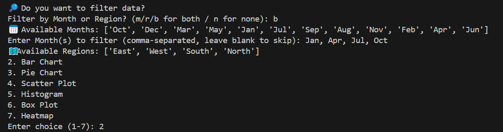
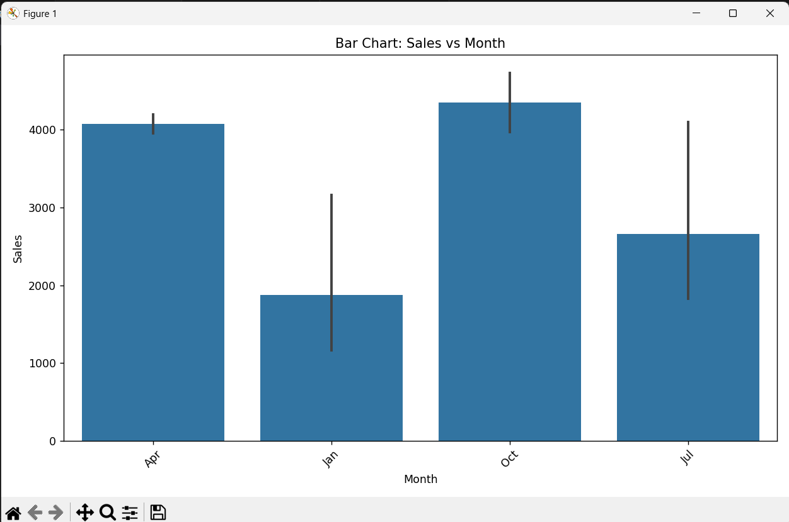
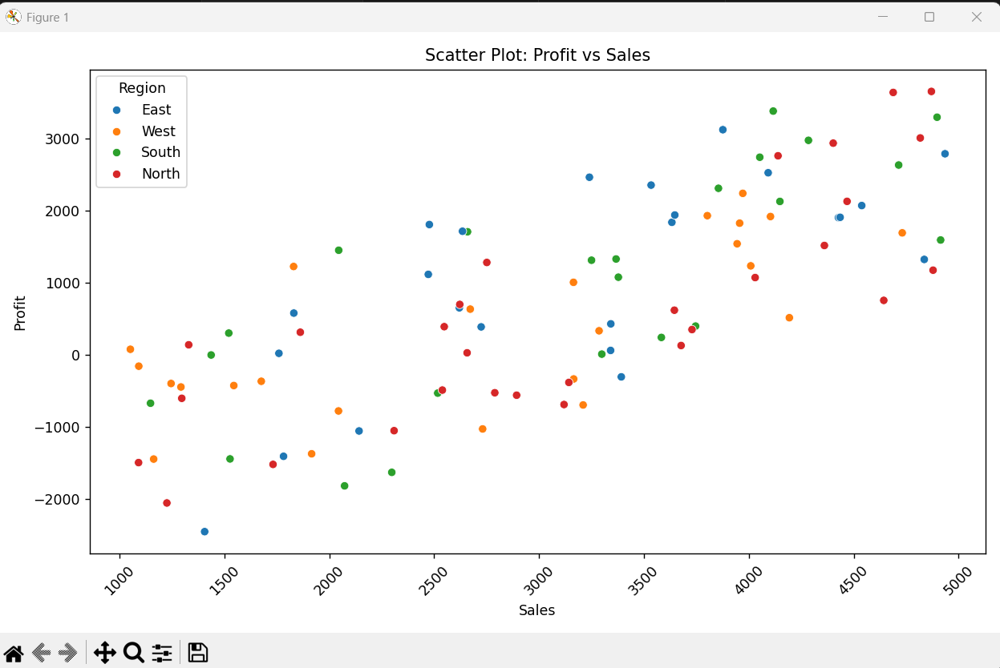
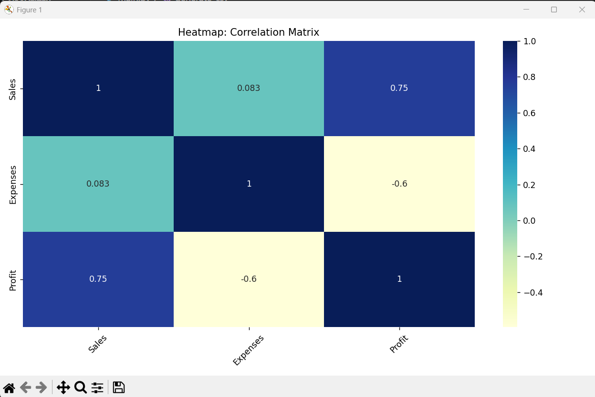
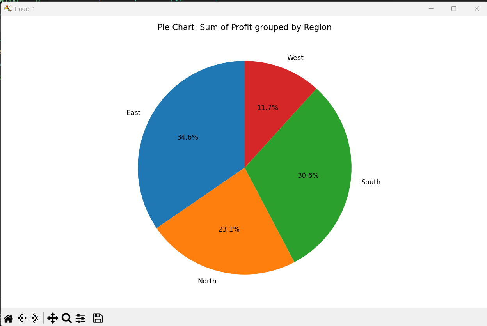

# 📊 Data Visualizer

A Python-based interactive data visualization tool that reads a CSV file and plots various charts using **pandas**, **matplotlib**, and **seaborn**. Ideal for quick analysis of sales, expenses, profits, or any structured data — directly from the terminal.

---

## 🚀 Features

* 📁 Load any CSV file
* 🧹 Filter data by **Month** and/or **Region**
* 📈 Plot the following chart types:

  * Line Chart
  * Bar Chart
  * Pie Chart
  * Scatter Plot
  * Histogram
  * Box Plot
  * Heatmap
* 💾 Option to save charts as `.png` images
* 🧪 Supports random CSV generation for testing (`sample2.csv` with 100+ rows)

---

## 📦 Requirements

* Python 3.7+
* Libraries:

  * pandas
  * matplotlib
  * seaborn

Install dependencies:

```bash
pip install pandas matplotlib seaborn
```

---

## 🛠️ How to Use

### 1. Clone the Repo

```bash
git clone https://github.com/chetan-palta/Data_Visualizer.git
cd Data_Visualizer
```

### 2. Run the Script

```bash
python main.py
```

### 3. Interact via Terminal

* Choose to generate sample data (optional)
* Load your CSV (`sample.csv` or `sample2.csv`)
* Select filters (Month, Region)
* Choose X and Y columns
* Pick chart type
* View or save the chart

---

## 📂 Example CSV Format

```csv
Month,Region,Sales,Expenses,Profit
Jan,North,2000,1000,1000
Feb,South,2500,1500,1000
Mar,East,3000,1800,1200
```

You can generate a test CSV with 100+ rows by selecting the "generate" option when prompted.

---

## 📸 Screenshots

| Filter Prompt              | Bar Chart Output     |
| -------------------------- | -------------------- |
|  |  |





---

## 📁 File Structure

```
Data_Visualizer/
├── main.py           # Main visualization script
├── sample.csv        # Default sample data
├── sample2.csv       # Random test data (generated)
├── README.md         # You're reading it 😉
├── filter_data.png   # Screenshot of filter UI
├── barchart.png      # Sample bar chart
├── scatterplot.png   # Sample scatter plot
├── heatmap.png       # Sample heatmap
├── piechart.png      # Sample pie chart
```

---

## ✅ To-Do / Future Enhancements

* [ ] Add GUI using Tkinter or PyQt
* [ ] Export charts & data summaries to PDF/Excel
* [ ] Add CLI arguments for automated usage
* [ ] Add animation support for charts
* [ ] Add dark/light theme toggle for UI version

---

## 🧠 Author

**Chetan Palta**
🔗 [GitHub](https://github.com/chetan-palta)
📬 [LinkedIn](https://www.linkedin.com/in/chetan-palta)

---

## 📄 License

This project is open-source under the [MIT License](LICENSE).

---

*This project is a work in progress. More features and visualizations coming soon!*
